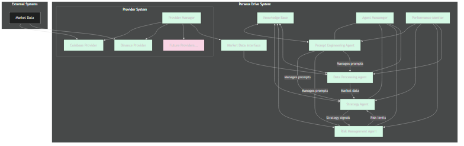

<p align="center">
  
</p>

# Perseus Drive

## Overview

Perseus Drive is an advanced trading system built with a recursive multi-agent architecture, designed to handle the entire trading lifecycle from market data processing to trade execution. The system employs specialized agents that communicate and collaborate through a sophisticated message-passing infrastructure, with each agent handling specific aspects of the trading process.

## Architecture

The system is built on a recursive agent-based architecture where specialized components work together through well-defined interfaces:

### Core Agents

1. **Prompt Engineering Agent** - Manages and optimizes prompts for all other agents, enabling the recursive nature of the system
2. **Strategy Agent** - Analyzes market data and generates trading signals
3. **Risk Management Agent** - Evaluates risk and validates trading signals
4. **Data Processing Agent** - Cleans and normalizes market data, calculates technical indicators
5. **Execution Agent** - Handles the actual execution of trades on exchanges

### Core Components

1. **Agent Messenger** - Facilitates communication between agents
2. **Knowledge Base** - Provides shared information storage and retrieval
3. **Provider Manager** - Manages connections to external data sources
4. **Performance Monitor** - Tracks and analyzes trading performance



## Recursive Prompt Reinjection System

A key innovation in Perseus Drive is its recursive prompt reinjection system, implemented through the Prompt Engineering Agent. This system:

1. Dynamically generates specialized prompts for each agent based on context
2. Continuously refines prompts based on performance feedback
3. Maintains prompt versioning to track evolution and effectiveness
4. Enables agents to adapt to changing market conditions
5. Creates a self-improving loop where system outputs inform future prompts

This recursive architecture allows the system to evolve and optimize its decision-making processes over time, leading to improved trading performance and adaptability.

## Getting Started

### Prerequisites

- Node.js 18.x or higher
- NPM 8.x or higher

### Installation

```bash
# Clone the repository
git clone https://github.com/yourusername/perseus-drive.git

# Navigate to the project directory
cd perseus-drive

# Install dependencies
npm install

# Configure environment variables
cp .env.example .env
# Edit .env with your configuration
```

### Running the System

```bash
# Start the main system
npm start

# Run in development mode with hot reloading
npm run dev

# Run all tests
npm test

# Run integration tests only
npm run test:integration
```

## System Configuration

Configuration can be adjusted through environment variables or by modifying configuration files:

| Parameter | Description | Default |
|-----------|-------------|---------|
| LOG_LEVEL | Logging verbosity | info |
| DATA_PROVIDERS | Enabled data providers | coinbase |
| EXECUTION_RETRY_ATTEMPTS | Number of retry attempts for failed orders | 3 |
| SLIPPAGE_TOLERANCE | Maximum acceptable slippage | 0.001 (0.1%) |

## Trading Strategies

Perseus Drive implements multiple trading strategies:

1. **Trend Following** - Identifies and follows market trends
2. **Mean Reversion** - Trades around statistical averages
3. **Breakout** - Identifies and trades breakouts from consolidation patterns
4. **Momentum** - Capitalizes on strong directional price movements
5. **Volume Profile** - Uses volume data to identify significant price levels

Custom strategies can be implemented by following the strategy registration framework.

## Exchange Connections

The system currently supports:

- **Coinbase** - Fully implemented
- **Binance** - Implementation in progress

## Project Structure

```
perseus-drive/
├── agents/                 # Agent implementations
│   ├── data-processing-agent.js
│   ├── execution-agent.js
│   ├── prompt-engineering-agent.js
│   ├── risk-management-agent.js
│   └── strategy-agent.js
├── docs/                   # Documentation
│   ├── assets/             # Images and diagrams
│   └── system-architecture.md
├── providers/              # External data providers
│   ├── base-provider.js
│   ├── binance-provider.js
│   ├── coinbase-provider.js
│   └── provider-manager.js
├── test/                   # Test suite
│   └── strategy-execution-integration.test.js
├── tools/                  # Shared utilities
│   ├── agent-messenger.js
│   ├── knowledge-base.js
│   └── logger.js
├── .env.example            # Environment variables template
├── index.js                # Main entry point
├── LICENSE                 # MIT License
└── package.json            # Dependencies and scripts
```

## Development Roadmap

- **Phase 1 (Completed)**: Core system architecture, agent communication, knowledge base
- **Phase 2 (Completed)**: Strategy agent, risk management, data processing, external providers
- **Phase 3 (Current)**: Execution agent, performance optimization, additional exchange support
- **Phase 4 (Planned)**: Portfolio management, backtesting framework, advanced ML strategies

## Contributing

Please read [CONTRIBUTING.md](CONTRIBUTING.md) for details on our code of conduct and the process for submitting pull requests.

## License

This project is licensed under the MIT License - see the [LICENSE](LICENSE) file for details. 