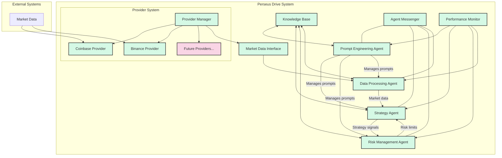

```mermaid
flowchart TD
    subgraph "Perseus Drive System"
        PE[Prompt Engineering Agent] --> |Manages prompts| SA[Strategy Agent]
        PE --> |Manages prompts| RM[Risk Management Agent]
        PE --> |Manages prompts| DP[Data Processing Agent]
        
        KB[Knowledge Base] <--> PE
        KB <--> SA
        KB <--> RM
        KB <--> DP
        
        AM[Agent Messenger] --- PE
        AM --- SA
        AM --- RM
        AM --- DP
        
        PM[Performance Monitor] --> PE
        PM --> SA
        PM --> RM
        PM --> DP
        
        DP --> |Market data| SA
        SA --> |Strategy signals| RM
        RM --> |Risk limits| SA
        
        MDI[Market Data Interface] --> DP
        
        subgraph "Provider System"
            PM1[Provider Manager] --> BP1[Coinbase Provider]
            PM1 --> BP2[Binance Provider]
            PM1 --> BP3[Future Providers...]
        end
        
        PM1 --> MDI
    end
    
    subgraph "External Systems"
        MD[Market Data] --> BP1
        MD --> BP2
    end
    
    classDef implemented fill:#d5f9e5,stroke:#333,stroke-width:2px;
    classDef inProgress fill:#f9f9d5,stroke:#333,stroke-width:2px;
    classDef planned fill:#f9d5e5,stroke:#333,stroke-width:2px;
    
    class PE,SA,DP,KB,AM,PM,MDI,PM1,BP1 implemented;
    class RM,BP2 implemented;
    class BP3 planned;
``` 