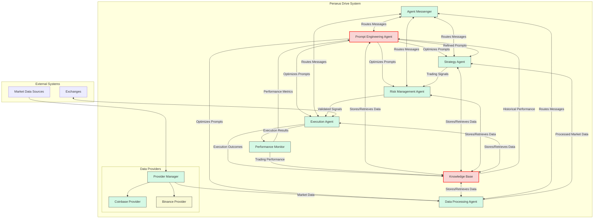

```mermaid
flowchart TD
    %% Main System Components
    subgraph "Perseus Drive System"
        PE[Prompt Engineering Agent]
        SA[Strategy Agent]
        RM[Risk Management Agent]
        DP[Data Processing Agent]
        EA[Execution Agent]
        
        KB[Knowledge Base]
        AM[Agent Messenger]
        PM[Performance Monitor]
        
        %% Core System Connections
        PE -->|Optimizes Prompts| SA
        PE -->|Optimizes Prompts| RM
        PE -->|Optimizes Prompts| DP
        PE -->|Optimizes Prompts| EA
        
        KB <-->|Stores/Retrieves Data| PE
        KB <-->|Stores/Retrieves Data| SA
        KB <-->|Stores/Retrieves Data| RM
        KB <-->|Stores/Retrieves Data| DP
        KB <-->|Stores/Retrieves Data| EA
        
        AM <-->|Routes Messages| PE
        AM <-->|Routes Messages| SA
        AM <-->|Routes Messages| RM
        AM <-->|Routes Messages| DP
        AM <-->|Routes Messages| EA
        
        %% Data Flow
        DP -->|Processed Market Data| SA
        SA -->|Trading Signals| RM
        RM -->|Validated Signals| EA
        EA -->|Execution Results| PM
        PM -->|Performance Metrics| PE
        PE -->|Refined Prompts| SA
        
        %% Recursive Feedback Loop
        EA -->|"Execution Outcomes"| KB
        PM -->|"Trading Performance"| KB
        KB -->|"Historical Performance"| PE
        
        %% Provider System
        subgraph "Data Providers"
            PMgr[Provider Manager]
            CP[Coinbase Provider]
            BP[Binance Provider]
            
            PMgr --> CP
            PMgr --> BP
        end
        
        PMgr -->|Market Data| DP
    end
    
    %% External Systems
    subgraph "External Systems"
        MD[Market Data Sources]
        EX[Exchanges]
        
        MD --> PMgr
        EX <--> EA
    end
    
    %% Recursive Prompt Reinjection - Highlighted Path
    classDef recursive fill:#f9d5d5,stroke:#ff0000,stroke-width:2px;
    class PE,KB recursive;
    
    %% Regular Components
    classDef standard fill:#d5f9e5,stroke:#333,stroke-width:1px;
    class SA,RM,DP,EA,AM,PM,PMgr,CP standard;
    
    %% In Progress Components
    classDef inProgress fill:#f9f9d5,stroke:#333,stroke-width:1px;
    class BP inProgress;
``` 