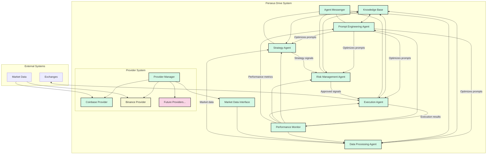
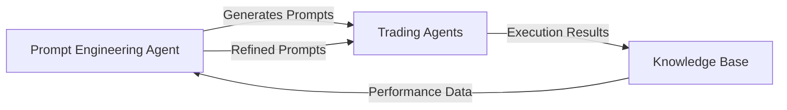

# Perseus Drive System Architecture

## Overview

Perseus Drive employs a recursive agent-based architecture for AI-driven trading and investment decision-making. The system consists of specialized agents that work together to analyze market data, develop strategies, evaluate risk, execute trades, and monitor performance. This document describes the current architecture and component relationships.

## Recursive Architecture

The system's recursive design is facilitated by the Prompt Engineering Agent, which generates and refines prompts for all other agents. This creates a feedback loop where:

1. Each agent receives optimized prompts from the Prompt Engineering Agent
2. Agents process their specific tasks (strategy development, risk assessment, execution)
3. Results and performance metrics are stored in the Knowledge Base
4. The Prompt Engineering Agent analyzes these outcomes to refine future prompts
5. Updated prompts create more effective agent behaviors in subsequent operations

This recursive pattern allows the system to continuously improve its decision-making capabilities based on past performance and changing market conditions.

## Agent Architecture

The system is built around specialized agents, each handling a specific aspect of the trading process:

### Core Agents

1. **Prompt Engineering Agent**
   - **Status**: Implemented and fully functional
   - **Function**: Manages and optimizes prompts for all other agents
   - **Features**:
     - Template management
     - Prompt versioning
     - Context optimization
     - Recursive prompt refinement

2. **Strategy Agent**
   - **Status**: Implemented and fully functional
   - **Function**: Develops and executes trading strategies
   - **Features**:
     - Multiple strategy implementations
     - Signal generation
     - Performance tracking
     - Strategy registration framework

3. **Risk Management Agent**
   - **Status**: Implemented and fully functional
   - **Function**: Evaluates risk and manages position sizing
   - **Features**:
     - Position sizing algorithms
     - Risk parameter configuration
     - Trade evaluation
     - Portfolio risk monitoring

4. **Data Processing Agent**
   - **Status**: Implemented and fully functional
   - **Function**: Processes and normalizes market data
   - **Features**:
     - Data cleaning
     - Feature engineering
     - Technical indicator calculation

5. **Execution Agent**
   - **Status**: Implemented and fully functional
   - **Function**: Optimizes order execution and handles trade execution
   - **Features**:
     - Order routing
     - Execution optimization
     - Transaction cost analysis
     - Market impact minimization

## External Data Provider System

The External Data Provider system consists of:

1. **Provider Manager**
   - **Status**: Implemented and fully functional
   - **Function**: Manages multiple data providers
   - **Features**:
     - Provider registration and management
     - Failover handling
     - Data normalization

2. **Coinbase Provider**
   - **Status**: Implemented and fully functional
   - **Function**: Connects to Coinbase exchange API
   - **Features**:
     - Real-time data via WebSocket
     - Historical data retrieval
     - Symbol mapping

3. **Binance Provider**
   - **Status**: Implementation in progress
   - **Function**: Connects to Binance exchange API
   - **Features**:
     - Real-time data via WebSocket
     - Historical data retrieval
     - Symbol mapping

## Core Components

1. **Knowledge Base**
   - **Status**: Implemented and fully functional
   - **Function**: Centralized data storage for agents
   - **Features**:
     - Persistent storage
     - Query capabilities
     - Data versioning

2. **Agent Messenger**
   - **Status**: Implemented and fully functional
   - **Function**: Facilitates communication between agents
   - **Features**:
     - Message routing
     - Message queuing
     - Agent registration

3. **Performance Monitor**
   - **Status**: Implemented and functional
   - **Function**: Tracks strategy performance
   - **Features**:
     - Win rate calculation
     - Profit factor analysis
     - Drawdown tracking

## Communication Protocol

All agent communication follows a standardized message format:

```json
{
  "id": "unique-message-id",
  "type": "message_type",
  "source": "sender_agent_id",
  "target": "recipient_agent_id",
  "content": { /* message payload */ },
  "timestamp": "ISO-8601 timestamp"
}
```

## System Architecture Diagram



## Recursive Prompt Reinjection Loop



## Current Status

The Perseus Drive system has completed implementation of all core agents (Prompt Engineering, Strategy, Risk Management, Data Processing, and Execution) with full Knowledge Base and Agent Messenger components. The system can process market data, generate trading signals, evaluate risk, execute trades, and track performance metrics.

The External Data Provider system has been implemented with a fully functional Provider Manager and Coinbase Provider. The Binance Provider implementation is in progress.

## Development Roadmap

Future components planned for Phase 3 include:
- Portfolio Management
- Backtesting Framework
- System Dashboard
- Machine Learning Integration

## Integration Points

| Component | Integrates With | Communication Method |
|-----------|-----------------|----------------------|
| Strategy Agent | Data Processing Agent, Risk Management Agent | Message Passing |
| Risk Management Agent | Strategy Agent, Execution Agent | Message Passing |
| Execution Agent | Risk Management Agent, External Exchanges | Message Passing, API Calls |
| Prompt Engineering Agent | All Agents | Knowledge Base, Message Passing |
| Provider Manager | External Data Sources, Data Processing Agent | API Calls, WebSockets | 