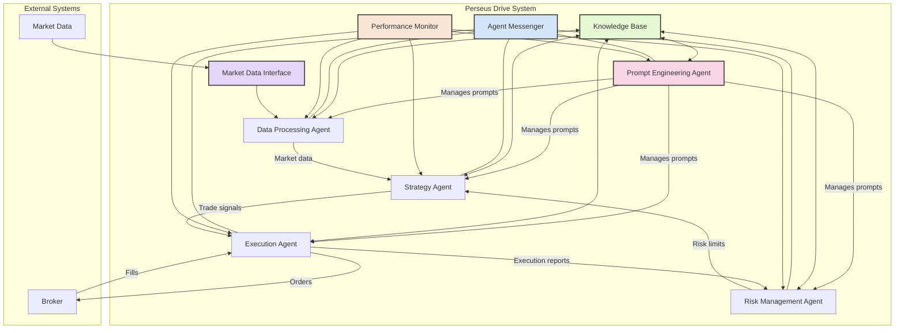

# Perseus Drive System Architecture

## Component Description

### Core Agents
- **Prompt Engineering Agent**: Central agent that manages and evolves prompts for all other agents
- **Strategy Agent**: Develops trading strategies and generates trading signals
- **Execution Agent**: Converts signals to executable orders and manages execution
- **Risk Management Agent**: Monitors portfolio risk and sets position limits
- **Data Processing Agent**: Collects, processes, and prepares market data

### MCP Tools
- **Agent Messenger**: Communication protocol for inter-agent messaging
- **Knowledge Base**: Central repository for shared knowledge
- **Performance Monitor**: Tracks and evaluates agent performance
- **Market Data Interface**: Standardized API for accessing market data

### External Systems
- **Market Data**: External market data providers
- **Broker**: Trading execution platform

## Data Flow

1. Market data flows into the system through the Market Data Interface
2. Data Processing Agent prepares and processes the data
3. Strategy Agent analyzes data and generates trading signals
4. Execution Agent converts signals to orders and sends to broker
5. Risk Management Agent monitors positions and applies risk limits
6. Prompt Engineering Agent continually optimizes all agent prompts based on performance
7. Knowledge is shared between agents via the Knowledge Base
8. All inter-agent communication happens through the Agent Messenger 