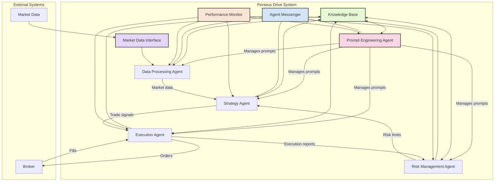

# Perseus Drive System Architecture

## System Overview
The Perseus Drive system uses a modular, agent-based architecture for AI-driven trading. Each specialized agent performs distinct functions while communicating through a secure, standardized protocol.

## Agents

### ✅ Prompt Engineering Agent 
- **Status**: Implemented and fully functional
- **Function**: Manages prompts for all agents, optimizing them for better performance
- **Features**:
  - Template management 
  - Prompt version control
  - Context optimization

### ✅ Strategy Agent
- **Status**: Implemented and fully functional
- **Function**: Creates, evaluates and executes trading strategies
- **Features**:
  - Signal generation for market trends
  - Performance tracking and metrics calculation
  - Strategy registration and management
  - Multiple strategy approaches (Mean Reversion, Breakout)
  - Inter-agent messaging for sharing signals

### 🔄 Risk Management Agent
- **Status**: Planned for future implementation
- **Function**: Monitors and manages trading risk
- **Features**: 
  - Position sizing
  - Portfolio risk analysis
  - Drawdown management

### 🔄 Execution Agent
- **Status**: Planned for future implementation
- **Function**: Executes trades and manages orders
- **Features**:
  - Order routing
  - Execution strategy
  - Transaction cost analysis

### ✅ Data Processing Agent
- **Status**: Implemented and fully functional
- **Function**: Processes and normalizes market data
- **Features**:
  - Data cleaning
  - Feature engineering
  - Technical indicator calculation

## Core Components

### ✅ Agent Messenger
- **Status**: Implemented and fully functional
- **Function**: Facilitates communication between agents
- **Features**:
  - Message routing
  - Message queuing
  - Agent registration

### ✅ Knowledge Base 
- **Status**: Implemented and fully functional
- **Function**: Centralized data storage for agents
- **Features**:
  - Persistent storage
  - Query capabilities
  - Versioning

### ✅ Performance Monitor
- **Status**: Implemented in Strategy Agent
- **Function**: Tracks strategy performance
- **Features**:
  - Win rate calculation
  - Profit factor analysis
  - Drawdown tracking

### ✅ Market Data Interface
- **Status**: Implemented and functional
- **Function**: Provides market data to agents
- **Features**:
  - Historical data retrieval
  - Real-time data streaming
  - Data normalization

## External Systems

### 🔄 Market Data
- **Status**: Basic implementation, expansion ongoing
- **Function**: Provides market data for analysis
- **Integration**: Through Data Processing Agent

### 🔄 Broker
- **Status**: Planned for future implementation
- **Function**: Executes trades in markets
- **Integration**: Will connect through Execution Agent

## Data Flow

### Current Implemented Flow
1. Data Processing Agent receives market data
2. Processed data is passed to Strategy Agent
3. Strategy Agent analyzes data using registered strategies
4. Trading signals are generated based on market conditions
5. Performance metrics are calculated and stored in Knowledge Base
6. Results are communicated to other agents via Agent Messenger

### Future Complete Flow
1. Data Processing Agent will receive market data
2. Processed data will be passed to Strategy Agent
3. Strategy Agent will analyze data and generate signals
4. Risk Management Agent will evaluate risk and position sizing
5. Execution Agent will convert signals to orders
6. Performance will be tracked across the entire process
7. Prompt Engineering Agent will optimize prompts based on results

## Communication Protocol
All agent communication follows a standardized message format:
```
{
  "id": "unique-message-id",
  "type": "message_type",
  "source": "sender_agent_id",
  "target": "recipient_agent_id",
  "content": { /* message payload */ },
  "timestamp": "ISO-8601 timestamp"
}
```

## Current Status
The Perseus Drive system currently has functioning Prompt Engineering, Strategy, and Data Processing agents with complete Knowledge Base and Agent Messenger components. The Strategy Agent has been successfully fixed to properly generate trading signals, track performance metrics, and communicate with other agents. The system can process market data, generate trading signals, and track performance but does not yet execute actual trades or manage risk adaptively.

